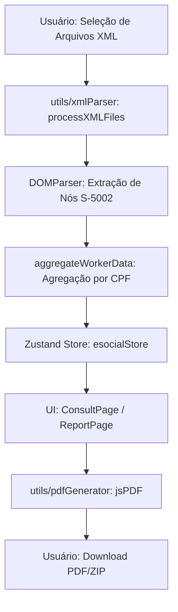

# Arquitetura Técnica: Gerador de Informe de Rendimentos e-Social

## 1. Visão Geral
O sistema é uma aplicação Single Page (SPA) construída com **React 18 + TypeScript + Vite**, projetada para operar **100% offline**. A privacidade é garantida pois nenhum dado processado (XML ou PDF) sai do navegador do usuário.

## 2. Fluxo de Dados (Data Flow)

## 3. Módulos Core

### 3.1 XML Parser (`src/utils/xmlParser.ts`)
O coração do sistema. Utiliza a API nativa `DOMParser` para percorrer a estrutura complexa do evento S-5002.
- **Agregação Inteligente**: Como um trabalhador pode ter múltiplos XMLs no ano (mensais), o parser utiliza um `Map<string, WorkerSummary>` onde a chave é o CPF.
- **Mapeamento de Rubricas**: O sistema identifica códigos de receita (`tpCR`) específicos para categorizar IRRF (Mensal, 13º, Férias, RRA).

### 3.2 Gerenciamento de Estado (`src/store/esocialStore.ts`)
Implementado com **Zustand** para uma gestão de estado atômica e performática.
- **Persistência Volátil**: Os dados residem apenas na RAM do navegador, sendo limpos ao atualizar a página (Segurança por design).
- **Filtragem Dinâmica**: Permite alternar entre visões anuais, mensais ou por período sem reprocessar os XMLs originais.

### 3.3 Gerador de Relatórios (`src/utils/pdfGenerator.ts`)
Utiliza **jsPDF** e **jsPDF-AutoTable** para reconstruir o layout oficial da Receita Federal.
- **Lógica de Layout**: Cálculos dinâmicos de coordenadas `y` para acomodar seções variáveis (Dependentes, RRA, Reembolso Médico).
- **Quebra de Página**: Implementada via `checkPageBreak` para garantir que seções não sejam cortadas.

## 4. Segurança e Privacidade
- **Zero Servidor**: Não há backend de processamento. Toda a lógica reside no `Main Thread` do navegador.
- **Sanitização**: IDs e metadados de XML são validados antes da agregação para evitar injeções de dados malformados.
